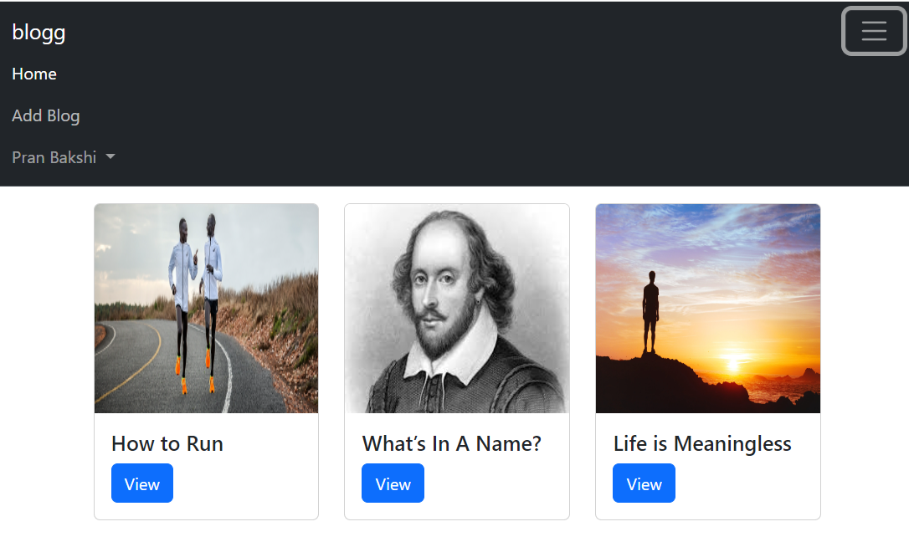

# Blog App

## Description:
This is a simple blogging application built on Node js.

## Table of Contents

- [Architecture](#architecture)
- [Installation](#installation)
- [Usage](#usage)
- [Screenshots](#screenshots)
- [Contributing](#contributing)
- [Additional Information](#addinfo)

## Architecture :
`index.js`: Database connection and server setup\
`views`: Client side static pages\
`models`: Mongoose models' definition\
`middlewares`: Contains the authentication middleware\
`routes`: Route definitions\
`controllers`: Controller function definitions, to write or read data\
`public`: Holds user image uploads and default images\
`services`: Functions to create and validate token to keep user signed in

## Installation :
To install the project, follow these steps:

Clone the repository: `https://github.com/pnaruka/blog_app`\
Navigate to the project directory: `cd blog_app`

Install dependencies: `npm install`

## Usage :
After installation, you can use the project as follows:

Run the project: `npm start`\
Access the application through your web browser at `http://localhost:8000` \
(You can change the port in index.js file)

## Screenshots :
`Signup`:  \
`Login`:  \
`Home`:  \
`Add Blog`:  \
`Blog View`:  \
`Comments`:  \

## Contributing :
Contributions are welcome! Here's how you can contribute:\
Fork the repository\
Create a new branch: `git checkout -b feature`\
Make your changes and commit them: `git commit -am 'Add new feature'`\
Push to the branch: `git push origin feature`\
Submit a pull request

## Additional Information 

For additional information or support, please contact the project maintainers at pankajnaruka111@gmail.com.